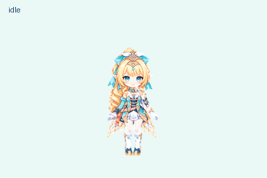

# 薇斯纳 Vesna-pet

根据角色视频制作的 Q 版桌宠素材：金色卷发、青绿服装、对称内收晶翼，以及带轻微透肤效果的白丝。

[下载桌宠安装包](https://github.com/Mahiru0427/Vesna-pet/releases/latest) · [安装步骤](#下载与安装) · [视频简介](docs/视频简介.md)



**推荐使用 Codex 桌面软件 + Pets 插件。本项目已在这条路线实际安装成功。**

这里下载的是桌宠图片素材，没有双击启动的 EXE。ChatGPT 网页版有条件可用兼容图；ChatGPT 桌面版导入本包尚未单独验证，其他桌宠软件也没有做适配。

## 下载与安装

第一次用？打开 **[小白安装教程](docs/安装说明.md)**，从安装 Pets、下载 ZIP、找到图片、添加到聊天到显示桌宠逐步操作。

简述：打开 Codex → 安装 Pets 插件 → 下载并解压安装包 → 将 `assets/vesna-v2.png` 添加到 Codex 聊天 → 让 Pets 导入并选中。

**直接复制给 Codex：**

> 请用 Pets 插件把我上传的这张图片导入为桌宠，名字叫“薇斯纳 Vesna”。图片和动作已经做好了，请先验证，验证通过后直接导入并选中，不要重新生成图片。完成后帮我显示桌宠。

如果找不到 Pets 插件，当前版本或账号可能没有入口；下载图片本身不能启用这个功能。

ChatGPT 网页版若有 Upload pet 入口，使用 `assets/vesna-v1.png`。它只在网页内显示，不能作为 Windows 桌面悬浮宠物。具体步骤和各软件的验证范围见 [安装教程](docs/安装说明.md)，网页能力依据 [官方 Pets 文档](https://learn.chatgpt.com/docs/pets)。

## 动作与使用范围

- 待机、向右跑、向左跑、挥手、跳跃、失落、等待、思考、检查。
- v2 额外提供十六个转头注视方向。
- 本机测试版本未持续跟随整个 Windows 桌面的普通鼠标；转头由宿主传入的注视目标触发。素材本身不会启用全局鼠标追踪。
- 应用中的桌宠使用小尺寸精灵单元；视频使用高清独立动作帧制作，两者显示清晰度不同。

## 文件位置

| 路径 | 内容 |
| --- | --- |
| `assets/vesna-v2.png` | 推荐完整桌宠精灵图 |
| `assets/vesna-v1.png` | 九行动作兼容图 |
| `assets/manifest.json` | 单元布局、方向与动作时长 |
| `previews/showcase.mp4` | 1080×1920、30 fps、约29.7秒的无声展示视频 |
| `previews/` | 动作、注视、封面和结尾预览 |
| `source/strips/` | 高清原始动作图条 |
| `source/render-frames/` | 73张已清理背景的高清透明帧 |
| `tools/render_video.py` | 可在本地重新导出竖屏视频 |
| `docs/视频简介.md` | 可直接复制的视频标题、简介和安装留言 |

## 重新导出视频

安装 Python 3.10 或更高版本，在项目目录执行：

```sh
python -m pip install -r requirements.txt
python tools/render_video.py
```

视频保存在 `build/vesna-showcase.mp4`，无旁白、无音乐。字幕和动作名称可直接在脚本中修改。使用项目自带的站酷快乐体；字体许可见 `fonts/OFL.txt`。

## 制作与使用说明

角色动作通过图像生成制作，再进行透明背景处理、尺寸对齐、组装和验证。完整 v2 精灵图通过结构检查、九动作检查、十六方向检查及独立视觉验收，并已成功导入当前用户的 Pets。安装到其他账号仍需自行导入，不包含制作者的账号或宠物ID。

角色原型和相关设计权益归对应权利方所有。本项目没有把角色素材声明为可商用的开源资产；如需转载、二次发布或商业使用，请自行取得所需授权。字体遵守随附 OFL 许可。
